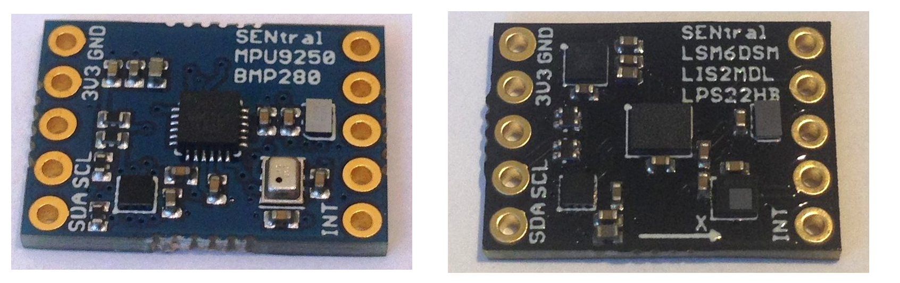

This repository contains a header-only Arduino library and Python
(MicroPython, WiringPi) library and examples for working with the incredible
EM7180 Ultimate Sensor Fusion Solution boards 
(both the [MPU9250 version](https://www.tindie.com/products/onehorse/ultimate-sensor-fusion-solution-mpu9250/)
and the
[LSM6DSM + LIS2MD version](https://www.tindie.com/products/onehorse/ultimate-sensor-fusion-solution-lsm6dsm--lis2md/))
from Pesky Products. 

The library has been tested on the following hardware:

* TinyPICO ESP32 development board

* Ladybug and Butterfly STM32L4 boards from Tlera Corp

* Teensy 3.2, 3.6, 4.0

* Raspberry Pi 3 (Python)

* PYBV1.0 : thanks to [JonHylands](https://github.com/jonhylands) for the MicroPython support

The Arduino library provides a simple API for for working with the EM7180 SENtral sensor hub.

The <b>examples</b> directory contains a simple Arduino sketch showing how to
use this API. As usual, just clone the repo into your Arduino libraries folder
to get started. The API and examples were adapted from Kris Winer's
[repository](https://github.com/kriswiner/EM7180_SENtral_sensor_hub).  I
strongly recommend reading Kris's
[wiki](https://github.com/kriswiner/EM7180_SENtral_sensor_hub/wiki) for a
comprehensive overview of the EM7180 and other sensor-fusion solutions, and for
instructions on how to
[calibrate](https://github.com/kriswiner/EM7180_SENtral_sensor_hub/wiki/F.--Magnetometer-and-Accelerometer-Calibration)
the EM7180 before you start using it.  (You can use my
[version](https://github.com/simondlevy/EM7180/tree/master/examples/WarmStartAndAccelCal)
of the calibration sketch.)

## Python on Raspberry Pi

To try the library out in Python, cd to the <b>extras/python</b> folder and do
<tt>python3 mastertest.py</tt>.  To install the library for access from other
directories, do <tt>sudo python3 setup.py install</tt>.

An asynchronous [version](https://github.com/bmegli/EM7180.git) of this library is also available for Teensy 3.5.

