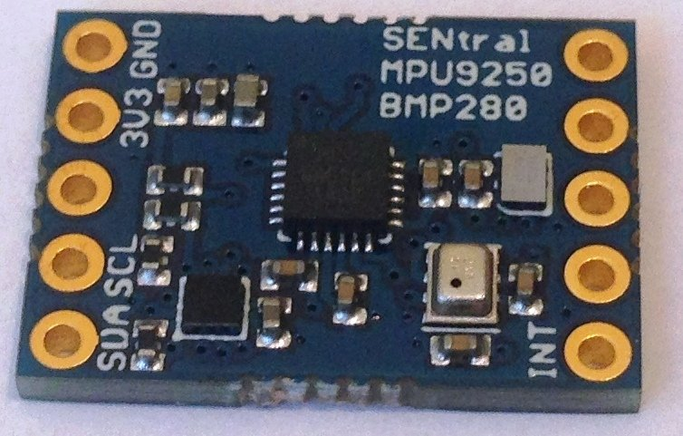

This repository contains Arduino and Raspberry Pi (WiringPi) libraries and examples for working with the incredible
<a href="https://www.tindie.com/products/onehorse/ultimate-sensor-fusion-solution/">
EM7180 Ultimate Sensor Fusion Solution</a> from Pesky Products. The library provides two C++ classes for
working with the EM7180 SENtral sensor hub on this board:

* An <b>EM7180</b> class providing a convenient API for the full functionality of the EM7180 unit

* An <b>EM7180Master</b> class that runs the EM7180 in master mode, for simple access to the sensor-fusion features

The <b>examples</b> directory contains sketches showing how to use these two classes. As usual, just clone the repo
into your Arduino libraries folder to get started. The class library and
examples were adapted from Kris Winer's [repository](https://github.com/kriswiner/EM7180_SENtral_sensor_hub).
We strongly recommend reading Kris's  [wiki](https://github.com/kriswiner/EM7180_SENtral_sensor_hub/wiki) for
a comprehensive overview of the EM7180 and other sensor-fusion solutions.

RaspberryPi users should download and install [WiringPi](http://wiringpi.com/),
then cd to the <b>examples</b> folders in <b>EM7180/extras/WiringPi/examples</b>, and run <b>make</b>
to build the examples.
